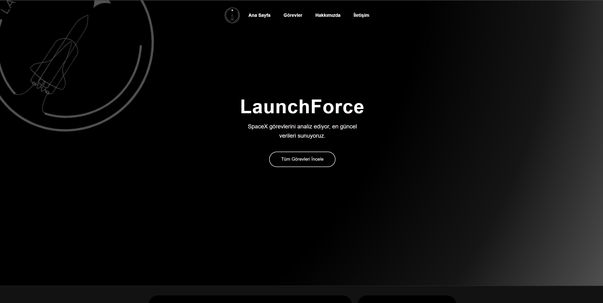
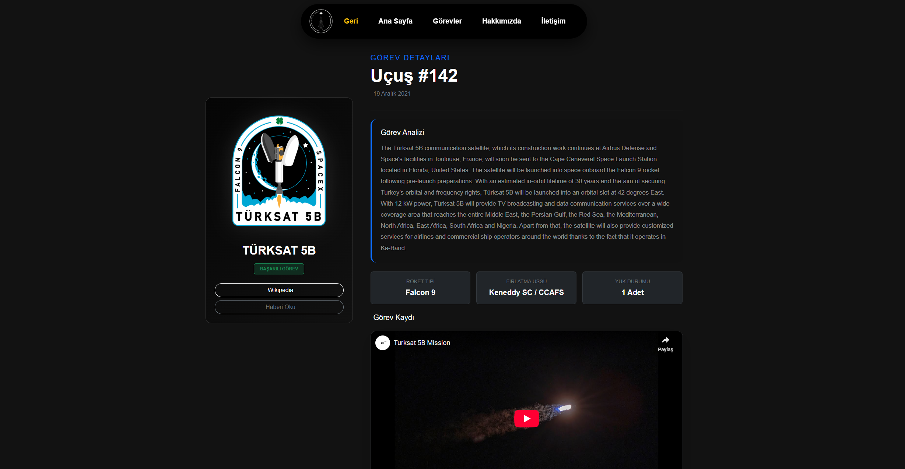

#  LaunchForce - SpaceX Analiz & Takip Platformu

**LaunchForce**, SpaceX Public API altyapısını kullanarak geliştirilmiş; roketleri, fırlatmaları, starlink uydularını ve uzay görevlerini anlık olarak takip etmeyi sağlayan modern bir **PWA (Progressive Web App)** projesidir.

Bu proje, statik bir web sitesi değil; canlı veri akışı sağlayan, çevrimdışı (offline) çalışabilen ve mobil cihazlara kurulabilen dinamik bir uygulamadır.

 **Canlı Demo:** ]
 **Tanıtım Videosu:** 

---

##  Ekran Görüntüleri

| Ana Sayfa (Dashboard) | Görev Arşivi & Filtreleme |
|  |

| Detay Sayfası (Kokpit) 
|  |

---

##  Kullanılan Teknolojiler & CSS Çatısı

Bu proje herhangi bir hazır CMS (WordPress vb.) kullanılmadan, tamamen modern web teknolojileri ile geliştirilmiştir.

* **HTML5 & CSS3:** Semantik yapı ve Responsive tasarım.
* **CSS Çatısı (Zorunlu):** [Bootstrap 5.3](https://getbootstrap.com) kullanılmıştır. Grid sistemi, kart yapıları, butonlar ve responsive navigasyon için temel alınmıştır.
* **JavaScript (ES6+):** Tüm veri çekme, filtreleme ve DOM manipülasyonu işlemleri **Vanilla JS** ile yazılmıştır.
* **Chart.js:** Fırlatma istatistiklerini görselleştirmek için kullanılmıştır.

---

##  API Kullanımı

Proje, verilerini **SpaceX API (v4 ve v5)** üzerinden `fetch()` yöntemi ile canlı olarak çekmektedir.

* **API Dokümantasyonu:** [https://github.com/r-spacex/SpaceX-API](https://github.com/r-spacex/SpaceX-API)
* **Base URL:** `https://api.spacexdata.com`

### Kullanılan Örnek Endpointler:

| Veri Türü | Endpoint | Kullanım Amacı |
|:--- |:--- |:--- |
| **Son Fırlatmalar** | `/v5/launches/past` | Ana sayfada son görevleri ve başarı oranını göstermek için. |
| **Gelecek Görev** | `/v5/launches/upcoming` | Geri sayım sayacı (Countdown) için. |
| **Tekil Görev** | `/v5/launches/{id}` | Detay sayfasında (`detail.html`) özel verileri çekmek için. |
| **Roketler** | `/v4/rockets` | Roketlerin boy ve ağırlıklarını karşılaştırmak için. |
| **Kapsüller** | `/v4/capsules` | Envanterdeki kapsüllerin durumunu listelemek için. |
| **Starlink** | `/v4/starlink` | Yörüngedeki aktif uydu sayısını analiz etmek için. |

---

##  PWA (Progressive Web App) Özellikleri

Bu uygulama, **Google Lighthouse** standartlarına uygun bir PWA olarak tasarlanmıştır.

### 1. Manifest (`manifest.json`)
Uygulamanın adı, ikonları (192x192, 512x512), tema rengi (`#0d6efd`) ve açılış şekli (`standalone`) tanımlanmıştır. Tarayıcıda "Yükle" butonu ile masaüstüne veya mobile uygulama gibi kurulabilir.

### 2. Service Worker (`service-worker.js`)
Arka planda çalışan bu script sayesinde:
* **App Shell Cache:** HTML, CSS, JS ve Bootstrap dosyaları önbelleğe alınır.
* **Hızlı Yükleme:** Tekrar girişlerde veriler cache üzerinden sunulur.

### 3. Offline Yeteneği
İnternet bağlantısı kesildiğinde uygulama çökmez:
* Önbellekteki sayfalar (Ana sayfa, Hakkımızda vb.) açılmaya devam eder.
* Önbellekte olmayan bir sayfaya girilirse özel tasarlanmış **`offline.html` (Bağlantı Koptu)** sayfası devreye girer.

---

## Proje Yapısı (Multi-Page)

Proje, kurumsal bir mimariye uygun olarak çok sayfalı (Multi-Page) yapıda kurgulanmıştır:

* **`index.html`:** Vitrin, Sayaç, Grafikler ve Özet Veriler.
* **`products.html`:** Görev Arşivi (Arama, Yıl/Durum Filtreleme, Sayfalama).
* **`detail.html`:** Seçilen görevin detaylı teknik analizi (URL parametresi ile çalışır).
* **`about.html`:** Proje ve Geliştirici hakkında kurumsal bilgiler, Tarihçe.
* **`contact.html`:** İletişim formu ve Tesis bilgileri.
* **`offline.html`:** İnternet kesintisinde devreye giren yedek sayfa.

---

##  Geliştirici

**Ad Soyad:** Tuna Kahraman
